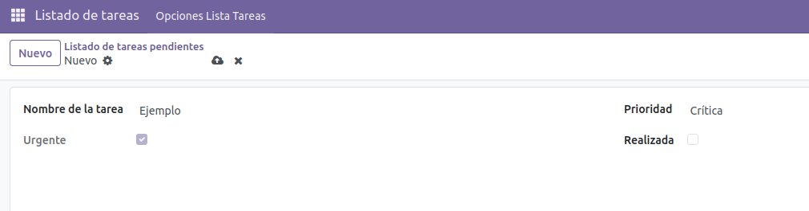
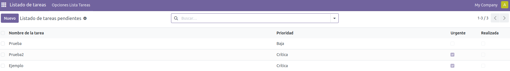

# Lista de Tareas

## Explicación del Proceso

### 1. Creación del módulo

#### **¿Qué hace el comando `odoo scaffold`?**

El comando `odoo scaffold nombre_modulo ruta` crea automáticamente la estructura de directorios y archivos necesarios para un nuevo módulo de Odoo. Esto nos ahorra tiempo creando carpetas manualmente y asegura que seguimos el estándar de Odoo, generando carpetas como `controllers`, `demo`, `models`, `views`, etc.

#### **¿Dónde se coloca el módulo?**

El módulo debe colocarse dentro de una ruta que esté definida en el `addons_path` del archivo de configuración de Odoo (`odoo.conf`). En nuestro entorno Docker, utilizamos la ruta `/mnt/extra-addons`, que es donde Odoo busca los módulos personalizados externos.

#### **¿Cómo se actualiza e instala?**

1.  Activamos el **modo desarrollador** en Odoo.
2.  Vamos al menú "Aplicaciones" y hacemos clic en **"Actualizar lista de aplicaciones"** para que Odoo detecte la nueva carpeta.
3.  Buscamos el módulo y pulsamos **Activar**.

### 2. Estructura y función de cada archivo

- **`__manifest__.py`**: Es el archivo de metadatos. Contiene un diccionario de Python con la información del módulo y, lo más importante, la lista de archivos de datos que el sistema debe cargar.
- **`models/models.py`**: Contiene la lógica y la definición de las tablas de la base de datos. Aquí definimos las clases que heredan de `models.Model` y sus campos.
- **`views/views.xml`**: Define la interfaz de usuario (UI). Aquí se declaran los menús, las acciones de ventana y cómo se muestran los datos para que el usuario pueda interactuar con el modelo.
- **`security/ir.model.access.csv`**: Gestiona los permisos de acceso. Define qué grupos de usuarios tienen permiso para leer, escribir, crear o eliminar registros en nuestro modelo.

---

## Modificaciones e Implementación

Para mejorar la funcionalidad del módulo base, se han realizado los siguientes cambios en `models.py` y en la vista correspondiente.

### 1. Cambio del sistema de prioridad

Se ha sustituido el sistema original, que usaba un número, por un sistema de niveles utilizando un campo `Selection`.

- **Cambio:** `prioridad = fields.Integer()` $\rightarrow$ `prioridad = fields.Selection(...)`
- **Justificación:** El uso de niveles explícitos ("Baja", "Media", "Alta", "Crítica") es más intuitivo para el usuario final y evita errores de entrada, como introducir números negativos o demasiado altos.

### 2. Lógica de urgencia

Se ha refactorizado la función `_value_urgente` para adaptarse al nuevo tipo de dato.

- **Lógica anterior:** Si `prioridad > 10` $\rightarrow$ Urgente.
- **Nueva lógica:** Si `prioridad` es "Alta" o "Crítica" $\rightarrow$ Urgente.
- **Decorador:** Se mantiene `@api.depends('prioridad')` para asegurar que el campo `urgente` se recalcula automáticamente cada vez que el usuario cambia la prioridad en el formulario.

### Demostración

Creación de la tarea:

Listado de tareas:

